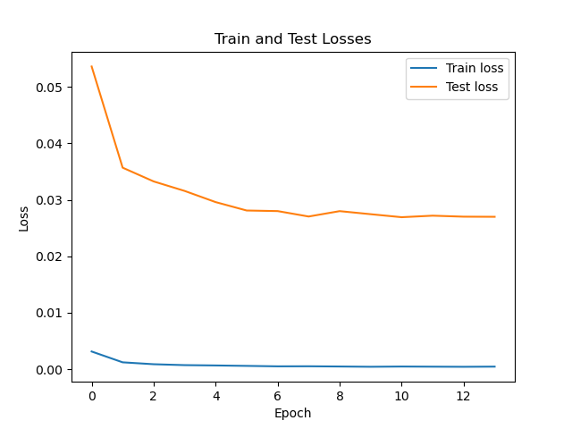

# Practical Session on GPU Computation Class
Prepared by: Hieng MAO
## A First Network: MNIST
### Exercise 1: Research, installation, first training
1. Conduct a thorough search about the MNIST (Modified National Institute of Standards and Technology) database. 
Since the searching for MNIST database, I have landed to a [Kaggle's page](https://www.kaggle.com/datasets/hojjatk/mnist-dataset) which shortly explains the dataset. The MNIST database / dataset is a subset of a larger set available from NIST (it's copied from http://yann.lecun.com/exdb/mnist/) which consists of handwritten digits which splitted into training set and testing set of 60,000 and 10,000 examples respectively. There are four files available for download:
    - `t10k-images-idx3-ubyte.gz` test set images (1,611 KB)
    - `t10k-labels-idx1-ubyte.gz` test set labels (5 KB)
    - `train-images-idx3-ubyte.gz` train set images (9,681 KB)
    - `train-labels-idx1-ubyte.gz` train set labels (29 KB)
2. After anaconda installation, we prepare the working environement and required packages installation as below:
    1. Create a new conda environment
```sh
conda create --name myenv python=3.11
```
The reason of python 3.11 is that I tried with python 3.12 but some package installation cannot be done with incompatibility error message.


    2. Activate the environment
```sh
conda activate myenv
```
After we have our working space, we installed the required package as below:

```
conda install numpy
```
```
conda install pandas
```
```
conda install pytorch torchvision torchaudio cpuonly -c pytorch
```
```
conda install matplotlib scikit-learn
```
Also install `h5py` for writing the `hdf5` file:
```
conda install h5py
``` 

>>> Note: for running on the GPU, you can install pytorch that compatible with CUDA version (e.g., `11.7`) using command below. Replace `x.x` with the desired CUDA version:
```
conda install pytorch torchvision torchaudio cudatoolkit=x.x -c pytorch
```

Since I use Windows, installing `soundfile` package to use as `torchaudio`'s backend as below:
```
conda install -c conda-forge pysoundfile
```

3. Executing the `main.py`
Since the `main.py` will us pytorch to download the MNIST dataset, for the first time it runs, the dataset will be downloaded, stored and extracted in the `data/MNIST/raw` directory. And by understanding the `main` function of the `main.py` file, We can run it with minimum requirement for the first time to download the dataset as command follow:
```
python main.py --epochs 1 --lr 1.1 
```
As the result, just one epoch training with learning rate 1.1, we receive a very good accuracy on the testing dataset of **9817/10000 (98%)** with average loss of **0.206047** which is quite good result. But our goal is not about accurary, make just ensure everything is functioning and the dataset is downloaded. The deeper code analysis and more experienment will be conducted as detail as describe below.

### Exercice 2: Code Analysis
1. Neural network structure: named `Net`, a subclass of pytorch's `nn` module which contains the following components:
    1. `self.conv1 = nn.Conv2d(1, 32, 3, 1)`: A convolutional layer with 1 input channel (since the data are grayscale image which has one value is intensity), 32 output channels (correspond to the 32 features map, e.g., vertical edge, horizontal edge, ...etc.), a kernel (convolutional filter) size of 3, and a stride of 1 (the filter move 1 pixel at a time during the convolution operation-a hyperparameter that control the step size of the kernel).
    2. `self.conv2 = nn.Conv2d(32, 64, 3, 1)`: An other convolutional layer with 32 input channels, 64 output channels, a kernel size of 3, and a stride of 1.
    3. `self.dropout1 = nn.Dropout2d(0.25)`: A dropout layer with a dropout probability of 0.25 that is used to avoid the model overfitting (The model / network performs very good with the training dataset but is not generalize for unseen data).
    4. `self.dropout2 = nn.Dropout2d(0.5)`: An other droput layer with a dropout probability of 0.5.
    5. `self.fc1 = nn.Linear(9216, 128)`: A fully connected layer with 9216 input features and 128 output features. Input of 9216 is not random picked. It is received from the flattened output from the previous layers which:
        - Input image of 28x28 pixels with 1 channel (grayscale).
        - First Conv layer of input (1, 28, 28), output (32, 26, 26) with calculation `output_size = (input_size - kernel_size) / stride + 1 = (28 - 3) / 1 +1 = 26`
        - Second Conv layer of input (32, 26, 26), output (64, 24, 24), with the same calculation `(26 - 3) / 1 + 1 = 24`.
        - Then, we do the max pooling (see `forward` function) `F.max_pool2d(x, 2)` of input (64, 24, 24), output (64, 12, 12) with calculation **pooling reduces each dimension by a factor of 2**
        - Therefore, the flattening the ouput into 1D tensor which is `64 * 12 * 12 = 9216`.
2. How the training and evaluation procedure operate?
- **Training Procedure**
The training procedure is defined in the `train` function which operates step by step as below:
    1. It sets the model to the training mode `True` using `model.train()` which affect to the dropout (`:class: Dropout`) and batch normalization (`:class: BatchNorm`).
    2. It iterates over the training data (images and labels) in batches on `train_loader` object of DataLoader to do:
        - It moves data to the appropriate device (CPU or GPU).
        - It clears the gradients of all optimized tensors before each backward pass, using `optimizer.zero_grad()`.
        - It does forward pass by computing the model's output passing through the network from the input, using `output = model(data)`.
        - It computes the Loss of negative log likihood loss between the model's output and the target labels, using `loss = F.nll_loss(output, target)` since the model is designed for classification tasks where the output is a probability distribution over multiple classes.
        - It computes the gradient of the loss with respect to the model parameters, using `loss.backward()`.
        - It updates the model parameters using the computed gradients, with `optimizer.step()`.
        - Lastly, it prints out the training epoch step and the loss value respectively to the given `args.log_interval`.

- **Evaluation Procedure**
The evaluation procedure is defined in the `test` function which operates step by step as below:
    1. It sets the model to the evaluation mode `True` using `model.eval()` which affect to the dropout and batch normalization.
    2. It records the average loss and the number of correct predictions.
    3. It disables the gradient calculation, which reduces memory consumption and speed up computation since gradients are not needed during evalutation, using `torch.no_grad()`.
    4. It iterates over the testing dataset to do:
        - It moves data to the appropriate device (CPU or GPU).
        - It does forwar pass by computing the model's output passing through the network from the input.
        - It computes the negative log-likelihood loss and summed up over the entire test set.
        - It predicts the class obtained by finding the index of the maximum log-probability.
        - The number of correct predictions is also accumulated.
    5. It averages the total loss by dividing by the number of samples in the test set.
    6. Finally, it prints out the evaluation results.

3. Optimizer
In this practice source code, the Adadelta optimizer is used which is an adaptive learning rate optimization algorithm designed to improve upon Adagrad. In detail, base on [keras.io](https://keras.io/api/optimizers/adadelta/), Adadelta is a stochastic gradient descent method that is based on adaptive learning rate per dimension to address two drawbaks:
- The continual decay of learning rates throughout training.
Adadelta dynamically adjuss the learning rate for each parameter based on a moving window of gradient updates, which helps in dealing with the diminishing learning rates problem faced by Adagrad.
- The need for a manually selected global learning rate.
Unlike some other optimizers, Adadelta does not require an initial learning rate to be set manually. Based on the adaptive learning rate which can simplify the hyperparameter tuning process.

One more advantage of Adadelta, since it uses a moving window of gradient updates instead of accumulating all past gradients, which makes it more memory efficient compared to Adagrad.

In summary, using Adadelta optimizer helps in automatically adjusting the learning rates during training, which can lead to better convergence and performance without the need for extensive hyperparameter tuning. 

### Exercise 3: Analysis of Loss Evolution During Training 
1. Modify the `train` and `test` function
Since we just want the average loss per epoch, we modify the `train` and `test` function to returns their total losses divided by total training and testing dataset respectively for `train` and `test` function. Therefor, we store all average losses of training and testing in a list corresponding to the epoches (`args.epoches`). 

In order to keep tracking the working history and to effeciently plot the graph, these losses are saved to a csv file in an `exports` folder.

Before we deep dive into the experiments below. Let us have a look at the dataset splitted for training and testing. Since both training and testing dataset use `DataLoader` to load data separatedly from pytorch's mnist API, the total of training data is **60,000** while the total of testing data is **1,000**. We use the training batch size of **64** while keeping the default testing batch size of **1,000**.  

2. **Experiment 1: Normal experiement**:
This experiment uses training set for trainging and testing set for testing and keep enabling the dropout layers. [Figure 1](#) is a Losses graph of this experiment.


*Figure 1: Losses Graph for Experiement 1: Normal.*

According to this graph, the network learns from data very well starting from epoch 2 and going slicely decreasing.

Even the testing graph contains up and down trend, but its global form towards descreasing which indicate that the network is not overffiting and is generalize for unseen data. So the model perform very well in this experiment.

Overal result from the test set, average loss is **0.0450** and its accuracy is **9844/10000 (98%)**.

3. **Experiment 2: Reversed data**:
This experiment, we reverse the training set for testing and the testing set for training but still keep enabling the dropout layers. [Figure 2](#) shows the Losses of this experiment.


*Figure 2: Losses Graph for Experiment 2: Reverse Data.*

In this experiment, the model learns from only **1,000** images but tested on **60,000** unseen images, it still performs as well as the first experiment (95%). The model learns very well since the beginning of the train (converge since the epoch 1). 

According to the testing graph, the model is still not overfitting since we use dropout layers during learning the data. 

Overal result from the test set, average loss is **0.1670** and accuracy is **56966/60000 (95%)**.

So base on these 2 experiments, using dropout layers is very powerful to avoid the model overfitting and let the model learns very well on the appropriate number of dataset. 

4. **Experiment 3: Reversed data + No Dropout layers**
This experiment, we keep reversing the training and testing dataset and we disable the dropout layers in the network for training. [Figure 3](#) shows the Losses of this experiment.


*Figure 3: Losses Graph for Experiment 3: Reverse Data + No Dropout Layers.*

The model is trained only on the 1,000 dataset and is tested against 60,000 dataset with the dropout layers disabled,  we still receive the same result as the [Experiment 2](#) above with the overal result, test set got average loss of **0.1771** and accuracy of **56823/60000 (95%)** (sliccely different from the Experiment 2). 

According to the testing graph, the model is still not overfitting and towards generalized even recieve the result as not good as our first experiment. 

5. **Experiment 4: No Dropout layers**
This experiment use training set for training and testing set for testing while removing/disabling the dropout layers for training.


*Figure 4: Losses Graph for Experiment 4: No Dropout Layers.*

The same as the [Experiment 1](#), the model learns very well. It converges at the second epoch and slicely decreasing the training losses.

The overal result on test set, the average loss is **0.0286** and the accuracy of **9918/10000 (99%)** which indicates the best accurracy among these experiments.

Eventhough the testing on training dataset received the best result, the testing on unseen dataset of 1,000 images, without dropout layers, the testing losses is **increasingly** which indicates that the model is **overfitting**. This mean that the model learns very well on the training dataset but unable to perform well on the unseen data, which leads to not generalized.

We can conclude that this model design is very suitable for this tasks of regconition the handwriting number from [mnist dataset](http://yann.lecun.com/exdb/mnist/). Even less data for testing, the model learns very fast and performs very well on the unseen dataset. Keep in mind of using dropout layers, which is a very powerful technique for avoiding the model overfitting.
 
6. Merge for training losses and testing losses graphs


*Figure 5: All Trains Losses Graph*


*Figure 5: All Tests Losses Graph*

By combining the graphs, we can better observe the "overfitting" on the case of **Disable Dropout layers**. We can see that on the training graph ([Figure 5](#)), the learning losses of "Disable Dropout" have the best learning curve among other experiments. It indicates that the model / network learns very good on the seen data. On the other hand, the testing losses curve of "Disable Dropout" tends to increase in its global form. This indicates that the model infers very bad on the unseen data which leads to not generalize, therefore, "overfitting".

### Exercise 4: Parameter Variations
Please find several experiments on each parameter as in [parameter_variation.xlsx](mnist/parameter_variations.xlsx).

In this experiment, I found out that the training's batch size data affects to the model performance. The more training batch size we provided, the more generalize model. We experimented the training batch size of **64, 256, 1000, and 2048**. 

For batch size of 64 and 256, we hav discussed that the model of **Disable Dropout layers** is overfitting. But for 1000 of batch size, the model of **Normal/Default** experiment became overfitting while Disable Dropout model not. For batch size of 2048, the 4 experiments models are no more overffiting.

So the surprising result is **the number of batch size affects the model performance. The higher batch size makes the model more generalized.**. How high the batch size we take depends on how much RAM of the training computer has.

We can further discuss the difference of the model performance on CPU and GPU by keeping our batch size of **2048**. By analysis on the merged graphs of training and testing losses for CPU and GPU training, there is different result regarding these trainings. The different is the time consumtion on CPU training which took longer to train compare to GPU training.

### Exercise 5: Performance Comparasion with ML alternative
