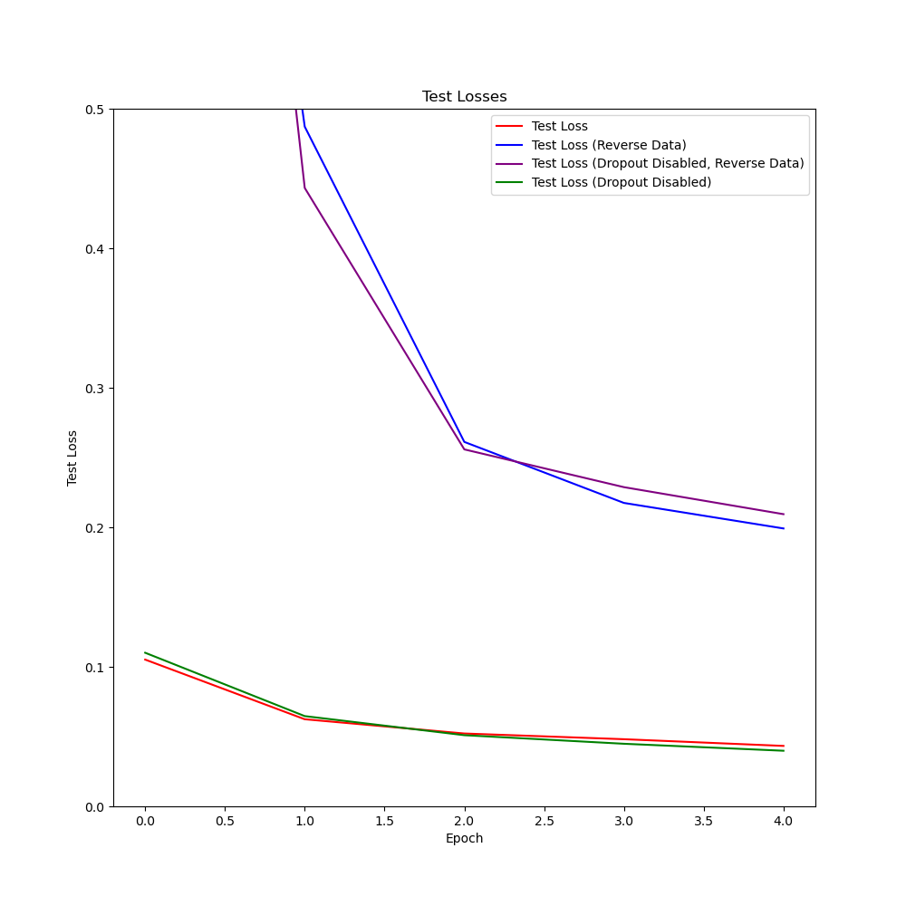
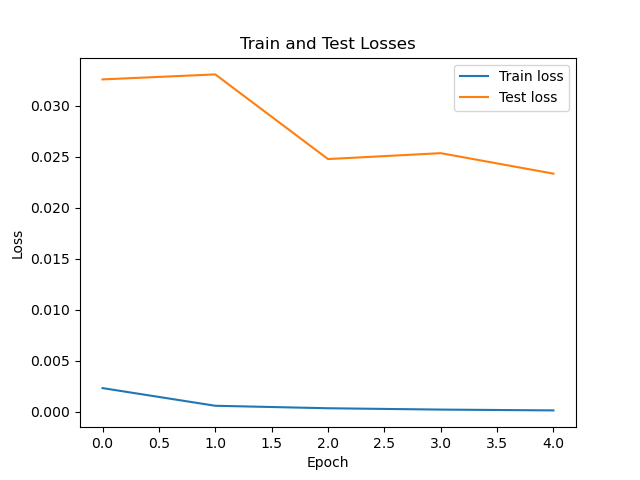

# Practical Session on GPU Computation Class
Prepared by: Hieng MAO

Date: 7th March 2025

Source: [Github](https://github.com/maohieng/learn_ai/blob/main/gpu/Practical_session.md)

**Table of Contents**
- [Practical Session on GPU Computation Class](#practical-session-on-gpu-computation-class)
  - [A First Network: MNIST](#a-first-network-mnist)
    - [Exercise 1: Research, installation, first training](#exercise-1-research-installation-first-training)
    - [Exercice 2: Code Analysis](#exercice-2-code-analysis)
    - [Exercise 3: Analysis of Loss Evolution During Training](#exercise-3-analysis-of-loss-evolution-during-training)
    - [Exercise 4: Parameter Variations](#exercise-4-parameter-variations)
    - [Exercise 5: Performance Comparasion with ML alternative](#exercise-5-performance-comparasion-with-ml-alternative)
    - [Exercise 6: First step toward reproducible research](#exercise-6-first-step-toward-reproducible-research)
  - [AudioMNIST: Optimizing Data Loading](#audiomnist-optimizing-data-loading)


## A First Network: MNIST
### Exercise 1: Research, installation, first training
1. Conduct a thorough search about the MNIST (Modified National Institute of Standards and Technology) database. 
Since the searching for MNIST database, I have landed to a [Kaggle's page](https://www.kaggle.com/datasets/hojjatk/mnist-dataset) which shortly explains the dataset. The MNIST database / dataset is a subset of a larger set available from NIST (it's copied from http://yann.lecun.com/exdb/mnist/) which consists of handwritten digits which splitted into training set and testing set of 60,000 and 10,000 examples respectively. There are four files available for download:
    - `t10k-images-idx3-ubyte.gz` test set images (1,611 KB)
    - `t10k-labels-idx1-ubyte.gz` test set labels (5 KB)
    - `train-images-idx3-ubyte.gz` train set images (9,681 KB)
    - `train-labels-idx1-ubyte.gz` train set labels (29 KB)
2. After anaconda installation, we prepare the working environement and required packages installation as below:
    1. Create a new conda environment
```sh
conda create --name myenv python=3.11
```

The reason of python 3.11 is that I tried with python 3.12 but some package installation cannot be done with incompatibility error message.

2. Activate the environment
```sh
conda activate myenv
```
After we have our working space, we installed the required package as below:

```
conda install numpy
```
```
conda install pandas
```
```
conda install pytorch torchvision torchaudio cpuonly -c pytorch
```
```
conda install matplotlib scikit-learn
```
Also install `h5py` for writing the `hdf5` file:
```
conda install h5py
``` 

> Note: for running on the GPU, you can install pytorch that compatible with CUDA version (e.g., `11.7`) using command below. Replace `x.x` with the desired CUDA version:
```
conda install pytorch torchvision torchaudio cudatoolkit=x.x -c pytorch
```

Since I use Windows, installing `soundfile` package to use as `torchaudio`'s backend as below:
```
conda install -c conda-forge pysoundfile
```

3. Executing the `main.py`
Since the `main.py` will us pytorch to download the MNIST dataset, for the first time it runs, the dataset will be downloaded, stored and extracted in the `data/MNIST/raw` directory. And by understanding the `main` function of the `main.py` file, We can run it with minimum requirement for the first time to download the dataset as command follow:
```
python main.py --epochs 1 --lr 1.1 
```
As the result, just one epoch training with learning rate 1.1, we receive a very good accuracy on the testing dataset of **9817/10000 (98%)** with average loss of **0.206047** which is quite good result. But our goal is not about accurary, make just ensure everything is functioning and the dataset is downloaded. The deeper code analysis and more experienment will be conducted as detail as describe below.

### Exercice 2: Code Analysis
1. Neural network structure: named `Net`, a subclass of pytorch's `nn` module which contains the following components:
    1. `self.conv1 = nn.Conv2d(1, 32, 3, 1)`: A convolutional layer with 1 input channel (since the data are grayscale image which has one value is intensity), 32 output channels (correspond to the 32 features map, e.g., vertical edge, horizontal edge, ...etc.), a kernel (convolutional filter) size of 3, and a stride of 1 (the filter move 1 pixel at a time during the convolution operation-a hyperparameter that control the step size of the kernel).
    2. `self.conv2 = nn.Conv2d(32, 64, 3, 1)`: An other convolutional layer with 32 input channels, 64 output channels, a kernel size of 3, and a stride of 1.
    3. `self.dropout1 = nn.Dropout2d(0.25)`: A dropout layer with a dropout probability of 0.25 that is used to avoid the model overfitting (The model / network performs very good with the training dataset but is not generalize for unseen data).
    4. `self.dropout2 = nn.Dropout2d(0.5)`: An other droput layer with a dropout probability of 0.5.
    5. `self.fc1 = nn.Linear(9216, 128)`: A fully connected layer with 9216 input features and 128 output features. Input of 9216 is not random picked. It is received from the flattened output from the previous layers which:
        - Input image of 28x28 pixels with 1 channel (grayscale).
        - First Conv layer of input (1, 28, 28), output (32, 26, 26) with calculation `output_size = (input_size - kernel_size) / stride + 1 = (28 - 3) / 1 +1 = 26`
        - Second Conv layer of input (32, 26, 26), output (64, 24, 24), with the same calculation `(26 - 3) / 1 + 1 = 24`.
        - Then, we do the max pooling (see `forward` function) `F.max_pool2d(x, 2)` of input (64, 24, 24), output (64, 12, 12) with calculation **pooling reduces each dimension by a factor of 2**
        - Therefore, the flattening the ouput into 1D tensor which is `64 * 12 * 12 = 9216`.
2. How the training and evaluation procedure operate?
- **Training Procedure**
The training procedure is defined in the `train` function which operates step by step as below:
    1. It sets the model to the training mode `True` using `model.train()` which affect to the dropout (`:class: Dropout`) and batch normalization (`:class: BatchNorm`).
    2. It iterates over the training data (images and labels) in batches on `train_loader` object of DataLoader to do:
        - It moves data to the appropriate device (CPU or GPU).
        - It clears the gradients of all optimized tensors before each backward pass, using `optimizer.zero_grad()`.
        - It does forward pass by computing the model's output passing through the network from the input, using `output = model(data)`.
        - It computes the Loss of negative log likihood loss between the model's output and the target labels, using `loss = F.nll_loss(output, target)` since the model is designed for classification tasks where the output is a probability distribution over multiple classes.
        - It computes the gradient of the loss with respect to the model parameters, using `loss.backward()`.
        - It updates the model parameters using the computed gradients, with `optimizer.step()`.
        - Lastly, it prints out the training epoch step and the loss value respectively to the given `args.log_interval`.

- **Evaluation Procedure**
The evaluation procedure is defined in the `test` function which operates step by step as below:
    1. It sets the model to the evaluation mode `True` using `model.eval()` which affect to the dropout and batch normalization.
    2. It records the average loss and the number of correct predictions.
    3. It disables the gradient calculation, which reduces memory consumption and speed up computation since gradients are not needed during evalutation, using `torch.no_grad()`.
    4. It iterates over the testing dataset to do:
        - It moves data to the appropriate device (CPU or GPU).
        - It does forwar pass by computing the model's output passing through the network from the input.
        - It computes the negative log-likelihood loss and summed up over the entire test set.
        - It predicts the class obtained by finding the index of the maximum log-probability.
        - The number of correct predictions is also accumulated.
    5. It averages the total loss by dividing by the number of samples in the test set.
    6. Finally, it prints out the evaluation results.

3. Optimizer
In this practice source code, the Adadelta optimizer is used which is an adaptive learning rate optimization algorithm designed to improve upon Adagrad. In detail, base on [keras.io](https://keras.io/api/optimizers/adadelta/), Adadelta is a stochastic gradient descent method that is based on adaptive learning rate per dimension to address two drawbaks:
- The continual decay of learning rates throughout training.
Adadelta dynamically adjuss the learning rate for each parameter based on a moving window of gradient updates, which helps in dealing with the diminishing learning rates problem faced by Adagrad.
- The need for a manually selected global learning rate.
Unlike some other optimizers, Adadelta does not require an initial learning rate to be set manually. Based on the adaptive learning rate which can simplify the hyperparameter tuning process.

One more advantage of Adadelta, since it uses a moving window of gradient updates instead of accumulating all past gradients, which makes it more memory efficient compared to Adagrad.

In summary, using Adadelta optimizer helps in automatically adjusting the learning rates during training, which can lead to better convergence and performance without the need for extensive hyperparameter tuning. 

### Exercise 3: Analysis of Loss Evolution During Training 
1. Modify the `train` and `test` function
Since we just want the average loss per epoch, we modify the `train` and `test` function to returns their total losses divided by total training and testing dataset respectively for `train` and `test` function. Therefor, we store all average losses of training and testing in a list corresponding to the epoches (`args.epoches`). 

In order to keep tracking the working history and to effeciently plot the graph, these losses are saved to a csv file in an `exports` folder.

Before we deep dive into the experiments below. Let us have a look at the dataset splitted for training and testing. Since both training and testing dataset use `DataLoader` to load data separatedly from pytorch's mnist API, the total of training data is **60,000** while the total of testing data is **1,000**. We use the training batch size of **256** while keeping the default testing batch size of **1,000**.  

2. **Experiment 1: Normal experiement**:  <a id='part:experiment1'></a>
This experiment uses training set for trainging and testing set for testing and keep enabling the dropout layers. [Figure 1](#figure1) is a Losses graph of this experiment.

<figure id="figure1">
  
  <figcaption><i>Figure 1: Losses Graph for Experiement 1: Normal.</i></figcaption>
</figure>

According to this graph, the network learns from data very well starting from epoch 2 and going slicely decreasing.

Even the testing graph contains up and down trend, but its global form towards descreasing which indicate that the network is not overffiting and is generalize for unseen data. So the model perform very well in this experiment.

Overal result from the test set, average loss is **0.0450** and its accuracy is **9844/10000 (98%)**.

1. **Experiment 2: Reversed data**:  <a id='part:experiment2'></a>
This experiment, we reverse the training set for testing and the testing set for training but still keep enabling the dropout layers. [Figure 2](#figure2) shows the Losses of this experiment.

<figure id="figure2">
  
  <figcaption><i>Figure 2: Losses Graph for Experiment 2: Reverse Data.</i></figcaption>
</figure>

In this experiment, the model learns from only **1,000** images but tested on **60,000** unseen images, it still performs as well as the first experiment (95%). The model learns very well since the beginning of the train (converge since the epoch 1). 

According to the testing graph, the model is still not overfitting since we use dropout layers during learning the data. 

Overal result from the test set, average loss is **0.1670** and accuracy is **56966/60000 (95%)**.

So base on these 2 experiments, using dropout layers is very powerful to avoid the model overfitting and let the model learns very well on the appropriate number of dataset. 

1. **Experiment 3: Reversed data + No Dropout layers** <a id='part:experiment3'></a>
This experiment, we keep reversing the training and testing dataset and we disable the dropout layers in the network for training. [Figure 3](#figure3) shows the Losses of this experiment.

<figure id="figure3">
  
  <figcaption><i>Figure 3: Losses Graph for Experiment 3: Reverse Data + No Dropout Layers.</i></figcaption>
</figure>

The model is trained only on the 1,000 dataset and is tested against 60,000 dataset with the dropout layers disabled,  we still receive the overal result, test set got average loss of **0.1771** and accuracy of **56823/60000 (95%)** which is slicely different from the [Experiment 2](#part:experiment2). 

According to the testing graph, the model is still not overfitting and towards generalized even recieve the result as not good as our first experiment. 

1. **Experiment 4: No Dropout layers** <a id='part:experiment4'></a>
This experiment use training set for training and testing set for testing while removing/disabling the dropout layers for training.

<figure id="figure4">
  
  <figcaption><i>Figure 4: Losses Graph for Experiment 4: No Dropout Layers.</i></figcaption>
</figure>

The same as the [Experiment 1](#part:experiment1), the model learns very well. It converges at the second epoch and slicely decreasing the training losses.

The overal result on test set, the average loss is **0.0286** and the accuracy of **9918/10000 (99%)** which indicates the best accurracy among these experiments.

Eventhough the testing on training dataset received the best result, the testing on unseen dataset of 1,000 images, without dropout layers, the testing losses is **increasingly** which indicates that the model is **overfitting**. This mean that the model learns very well on the training dataset but unable to perform well on the unseen data, which leads to not generalized.

We can conclude that this model design is very suitable for this tasks of regconition the handwriting number from [mnist dataset](http://yann.lecun.com/exdb/mnist/). Even less data for testing, the model learns very fast and performs very well on the unseen dataset. Keep in mind of using dropout layers, which is a very powerful technique for avoiding the model overfitting.
 
1. Merge for training losses and testing losses graphs

<figure id="figure5">
  <div style="display: flex; justify-content: space-between;">
    
    
  </div>
  <figcaption><i>Figure 5: All Train and Test Losses Graph.</i></figcaption>
</figure>

By combining the graphs, we can better observe the "overfitting" on the case of **Disable Dropout layers**. We can see that on the training graph ([Figure 5](#)), the learning losses of "Disable Dropout" have the best learning curve among other experiments. It indicates that the model / network learns very good on the seen data. On the other hand, the testing losses curve of "Disable Dropout" tends to increase in its global form. This indicates that the model infers very bad on the unseen data which leads to not generalize, therefore, "overfitting".

### Exercise 4: Parameter Variations
Please find several experiments on each parameter as in [parameter_variation.xlsx](mnist/parameter_variations.xlsx).

In this experiment, we experimented the training batch size of **64, 256, 1000, and 2048**. 

<figure id="figure7">
    <div style="display: flex; justify-content: space-between;">
    
    
    </div>
  <figcaption><i>Figure 7: Experiment in training batch size of 1000.</i></figcaption>
</figure>

<figure id="figure8">
    <div style="display: flex; justify-content: space-between;">
    
    
    </div>
  <figcaption><i>Figure 8: Experiment in training batch size of 2048 (GPU device).</i></figcaption>
</figure>

For batch size of 64 and 256, we discussed earlier, the model of **Disable Dropout layers** is overfitting. But for 1000 of batch size, the model of **Normal/Default** experiment became "overfitting" while **Disable Dropout** model not. For batch size of 2048, the 4 experiments models are no longer become overffiting.

So the surprising result is **the number of batch size affects the model performance. The higher batch size makes the model more generalized.**. How high the batch size, it depends on how much RAM and GPU VRAM we have for training.

We can further discuss the difference of the model performance on CPU and GPU by keeping our batch size of **2048**. By analysis on the merged graphs of training and testing losses for CPU and GPU training, there is different result regarding these trainings. The different is the time consumtion on CPU training which took longer to train compare to GPU training.

<figure id="figure8">
    <div style="display: flex; justify-content: space-between;">
    
    
    </div>
  <figcaption><i>Figure 8: Experiment in training batch size of 2048 (CPU device).</i></figcaption>
</figure> 

### Exercise 5: Performance Comparasion with ML alternative
1. Resnet Model
Resnet stands for Residual Networks, which designed to solve the **vanishing/exploding gradient** in the paper [Deep Residual Learning for Image Recognition](https://arxiv.org/abs/1512.03385). Vanishing/Exploding gradient is a problem in deep learning that causes the gradient to become 0 or too large. 

We modified `main_resnet.py` in the same way as modifying `main.py`. Since I hav made a lot of changes to `main.py` for more general usage and for reusabe code, we can just import `SimpleResNet` from `main_resnet`.

Below are some experiments on the Resnet model:

<figure id="figure9">
    <div style="display: flex; justify-content: space-between;">
    
    
    
    </div>
  <figcaption><i>Figure 9: Resnet Experiments in batch size 64, 2048+gamma0.7, 2048+gamma1.0 respectively.</i></figcaption>
</figure> 

We found out the experiment on Resnet with **gamma 1.0** affects to the model performance (overfitted) while gamma 0.7 is not. We choose **gamma 0.7** for our best hyper parameter.

Therefore, out best hyper-parameters: **learning rate 1.0, gamma 0.7, batch size 2048**.

Further more on Resnet:

<figure id="figure10">
    <div style="display: flex; justify-content: space-between;">
    
    
    </div>
  <figcaption><i>Figure 10: Resnet Train and Test Losses Respectivly.</i></figcaption>
</figure> 

1. Time Consumption:

Average inference time , first model (`Net`) got **1.87** millisecond per image, while the Resnet model (`SimpleResenet`) got **1.85** milliseconds per image.

| Time \ Model| Net       | SimpleResnet       |
|:---------------:|:----------------:|:----------------:|
| Total training time (**seconds**)   | 45.27269768714905  | 48.19700574874878  |
| Average testing time (**seconds**)   | 1.6809328079223633  | 1.7842947483062743  |
| Average inferent time per image (**milliseconds**)   | **1.68**  | **1.78**  |
*Table 1: Time Consumption between Net and SimpleResnet Model.*<a id='table:1'></a>

> Note: Experiments are conducted on NVIDIA A40.

3. **SVM**

Support Vector Machine (SVM) is a supervised learning model / technique used for classification and regression tasks. Here is how SVM works (copied from Internet):
- **Objective**: SVM aims to find the optimal hyperplane that best separate the data points to different classes in the feature spaces. The optimal hyperplane is the one that maximizes the margin between the closest points of the classes, known as support vector.
- **Hyperplane**: In 2D space, a hyperplane is a line that separates the data points into 2 classes. In higher dimension, it becomes a plane or hyperplane.
- **Margin**: The margin is the distance between hyperplane and the nearest data points from each class. SVM tries to maximize this margin to ensure that the model generalize well to unseen data.
- **Support Vectors**: These are the data points that are closest to the hyperplane and influence its position and orientation. Only these points are used to determine the hyperplane.
- **Kernel Trick**: SVM can efficiently perform a non-linear classification using the kernel trick. The kernel function transforms the input data into a higher-dimensional space where a linear hyperplane can be used to separate the classes. Common kernels include linear, polynomial, and radial basis function (RBF).
- **Regularization Parameter (C)**: This parameter controls the trade-off between achieving a low error on the training data and minimizing the margin. A smaller C value allows for a larger margin but may result in some misclassifications, while a larger C value aims for fewer misclassifications but with a smaller margin.
- **Gamma (γ)**: This parameter is specific to the RBF kernel and defines how far the influence of a single training example reaches. A low gamma value means that the influence is far, while a high gamma value means that the influence is close.

Back to our code `main_svm.py`, an SVM classifier with an RBF kernel is created and trained on the MNIST dataset. The classifier is then evaluated on the test set, and the results are visualized using a confusion matrix and sample predictions.

```
Rapport de classification :
               precision    recall  f1-score   support

           0       1.00      1.00      1.00        33
           1       1.00      1.00      1.00        28
           2       1.00      1.00      1.00        33
           3       1.00      0.97      0.99        34
           4       1.00      1.00      1.00        46
           5       0.98      0.98      0.98        47
           6       0.97      1.00      0.99        35
           7       0.97      0.97      0.97        34
           8       1.00      1.00      1.00        30
           9       0.97      0.97      0.97        40

    accuracy                           0.99       360
   macro avg       0.99      0.99      0.99       360
weighted avg       0.99      0.99      0.99       360
```

| Time \ Model| SVM       |
|:---------------:|:----------------:|
| Total training time (**seconds**)   | 0.07  |
| Average inferent time per image (**milliseconds**)   | **0.07**  |
*Table 2: Time Consumption of SVM Model.*<a id='table:2'></a>

> Note: SVM runs on CPU of 42 cores of Intel(R) Xeon(R) Silver 4310 CPU @ 2.10GHz.

SVM received very high accuracy of **99%** while its training time and inferent time is far less that the 2 models above while it runs on a powerfull CPU.

4. Profiling
-`Net`'s profile, `python -m cProfile -s time main.py --epochs 1`:
```
   ncalls  tottime  percall  cumtime  percall filename:lineno(function)
      952   10.558    0.011   10.558    0.011 {method 'poll' of 'select.poll' objects}
    13276    2.052    0.000    2.053    0.000 {built-in method posix.read}
      938    1.923    0.002    1.923    0.002 {method 'run_backward' of 'torch._C._EngineBase' objects}
   103/97    0.709    0.007    0.823    0.008 {built-in method _imp.create_dynamic}
     1896    0.638    0.000    0.638    0.000 {built-in method torch.conv2d}
```

- `SimpleResnet`'s profile, `python -m cProfile -s time main.py --model-name resnet --epochs 1`:
```
   ncalls  tottime  percall  cumtime  percall filename:lineno(function)
      952    8.963    0.009    8.965    0.009 {method 'poll' of 'select.poll' objects}
      938    2.621    0.003    2.621    0.003 {method 'run_backward' of 'torch._C._EngineBase' objects}
    13276    2.155    0.000    2.157    0.000 {built-in method posix.read}
     3792    0.956    0.000    0.956    0.000 {built-in method torch.conv2d}
```
- `SVM`s' profile, `python -m cProfile -s time main_svm.py`:
```
   ncalls  tottime  percall  cumtime  percall filename:lineno(function)
     1301    0.196    0.000    0.196    0.000 {built-in method marshal.loads}
     7704    0.108    0.000    0.203    0.000 inspect.py:882(cleandoc)
        1    0.070    0.070    0.070    0.070 _base.py:312(_dense_fit)
     1054    0.065    0.000    0.066    0.000 __init__.py:65(check_isinstance)
```

We can see the model `Net` and `SimpleResnet` spends a lot of computing time on the `run_backward` function. The `run_backward` function consumes the computing resource to create the computational graphs in inverse order and applying the chain rule for calculating the gradient in order to update the model's weights. 

- `Net` Losses

|Run with  |train_loss   |test_loss    |train_time   |test_time    |
|:---------------:|:---------------:|:----------------:|:---------------:|:----------------:|
|`cProfile`  |0.0031381108467311907  |0.05394637870788574  |19.77141809463501  |2.6587979793548584 |
|None |0.0031416568973955386  |0.05129043960571289  |13.139026403427124 |1.8098640441894531 |

- `SimpleResnet` Losses

|Run with  |train_loss   |test_loss    |train_time   |test_time    |
|:---------------:|:---------------:|:----------------:|:---------------:|:----------------:|
|`cProfile`  |0.002332769167984952 |0.02969202308654785  |21.171854972839355 |2.7359092235565186 |
|None   |0.002300764407834504 |0.033819875717163085 |13.263878107070923 |1.9294891357421875 |

- `SVM` Losses

|Run with    |train_time   |test_time    |
|:---------------:|:---------------:|:----------------:|
|`cProfile`  |0.06949853897094727 |0.025006771087646484 |
|None   |0.06062579154968262 |0.024107694625854492 |

We can say: running with `python -m cProfile main.py...` takes more time to run than using `python main.py...`, while training and testing losses remain almost the same.

### Exercise 6: First step toward reproducible research
1. We exported the installed packages in current conda enviroment using `conda` and `pip` from 2 different OS, Linux and Windows.

- Linux OS
  1. Using `pip freeze > exports/linux_pip_requirements.txt`
Here is an example output file `linux_pip_requirements.txt`:
```
threadpoolctl @ file:///croot/threadpoolctl_1719407800858/work
torch==2.5.1
torchaudio==2.5.1
torchvision==0.20.1
tornado @ file:///croot/tornado_1733960490606/work
triton==3.1.0
typing_extensions @ file:///croot/typing_extensions_1734714854207/work
tzdata @ file:///croot/python-tzdata_1690578112552/work
unicodedata2 @ file:///croot/unicodedata2_1736541023050/work
urllib3 @ file:///croot/urllib3_1737133630106/work
wheel==0.45.1
```
We can see that the export file contains many local machine references (`file:///`) which COULD only be used to create new environment in the same machine (this linux machine) via `pip`. Result (success or fail) of using this file will be discuss later below.

  2. Using `conda list --export > exports/linux_conda_requirements2.txt`
Here is the example snapshot we got in file `linux_conda_requirements2.txt`:
```
torch=2.5.1=pypi_0
torchaudio=2.5.1=pypi_0
torchtriton=3.1.0=py312
torchvision=0.20.1=pypi_0
tornado=6.4.2=pypi_0
triton=3.1.0=pypi_0
typing-extensions=4.12.2=pypi_0
typing_extensions=4.12.2=py312h06a4308_0
tzdata=2025a=h04d1e81_0
unicodedata2=15.1.0=pypi_0
urllib3=2.3.0=pypi_0
wheel=0.45.1=pypi_0
xcb-util-cursor=0.1.4=h5eee18b_0
xz=5.6.4=h5eee18b_1
yaml=0.2.5=h7b6447c_0
zlib=1.2.13=h5eee18b_1
zstd=1.5.6=hc292b87_0
```
We can try to use this file in the machine but new enviroment or on the Windows machine as will discussed later.

  3. Using `conda list --explicit > exports/linux_conda_requirements.txt`, in the format that can be used to recreate the enviroment.
Here is an example in the file `linux_conda_requirements.txt`:
```
https://repo.anaconda.com/pkgs/main/linux-64/numpy-2.2.2-py312hc5e2394_0.conda
https://repo.anaconda.com/pkgs/main/linux-64/numexpr-2.10.1-py312h3c60e43_0.conda
https://repo.anaconda.com/pkgs/main/linux-64/scipy-1.15.1-py312hc5e2394_0.conda
https://repo.anaconda.com/pkgs/main/linux-64/pandas-2.2.3-py312h6a678d5_0.conda
https://repo.anaconda.com/pkgs/main/linux-64/scikit-learn-1.6.1-py312h6a678d5_0.conda
https://conda.anaconda.org/pytorch/linux-64/pytorch-2.5.1-py3.12_cuda12.1_cudnn9.1.0_0.tar.bz2
https://conda.anaconda.org/pytorch/linux-64/torchaudio-2.5.1-py312_cu121.tar.bz2
https://conda.anaconda.org/pytorch/linux-64/torchtriton-3.1.0-py312.tar.bz2
https://conda.anaconda.org/pytorch/linux-64/torchvision-0.20.1-py312_cu121.tar.bz2
```
This export format is good for recreating new environment since it point directly to the download URL rather than just version. But it can be used for the OS platform that it exported, for instance the export file above can be use on other Linux machine.

  4. Using `conda env export > exports/linux_environment.yml`
Here is example snapshot of file `linux_environment.yml`:
```
name: new_env
channels:
  - pytorch
  - nvidia
  - defaults
dependencies:
  - _libgcc_mutex=0.1=main
  - _openmp_mutex=5.1=1_gnu
  - blas=1.0=mkl
  ...
  - wheel==0.45.1
prefix: /home/rnd/anaconda3/envs/new_env
```
This file contains the dependency of local reference or "environment name".

- Windows OS
  - Using `pip freeze > exports/win_pip_requirements.txt`
Here is an example of snapshot result in file `win_pip_requirements.txt`:
```
torch==2.5.1
torchaudio==2.5.1
torchvision==0.20.1
tornado @ file:///C:/b/abs_7cyu943ybx/croot/tornado_1733960510898/work
traitlets @ file:///home/conda/feedstock_root/build_artifacts/traitlets_1733367359838/work
typing_extensions @ file:///C:/b/abs_0ffjxtihug/croot/typing_extensions_1734714875646/work
tzdata @ file:///croot/python-tzdata_1690578112552/work
unicodedata2 @ file:///C:/b/abs_dfnftvxi4k/croot/unicodedata2_1736543771112/work
urllib3 @ file:///C:/b/abs_7bst06lizn/croot/urllib3_1737133657081/work
wcwidth @ file:///home/conda/feedstock_root/build_artifacts/wcwidth_1733231326287/work
Werkzeug @ file:///home/conda/feedstock_root/build_artifacts/werkzeug_1733160440960/work
wheel==0.45.1
win-inet-pton @ file:///C:/Users/dev-admin/perseverance-python-buildout/croot/win_inet_pton_1699472992992/work
zipp @ file:///home/conda/feedstock_root/build_artifacts/zipp_1732827521216/work
```
The same as exporting on Linux, the file contains local file references instead of package's version. This file could only be used in the same machine to create an environment via `pip`.

  - Using `conda list --export > exports/win_conda_requirements.txt` 
Here is an example snapshot of result in file `win_conda_requirements.txt`:
```
torchaudio=2.5.1=py312_cpu
torchvision=0.20.1=py312_cpu
tornado=6.4.2=py312h827c3e9_0
traitlets=5.14.3=pyhd8ed1ab_1
typing_extensions=4.12.2=py312haa95532_0
tzdata=2025a=h04d1e81_0
ucrt=10.0.22621.0=h57928b3_1
unicodedata2=15.1.0=py312h827c3e9_1
urllib3=2.3.0=py312haa95532_0
vc=14.42=haa95532_4
vc14_runtime=14.42.34438=hfd919c2_24
vs2015_runtime=14.42.34438=h7142326_24
wcwidth=0.2.13=pyhd8ed1ab_1
werkzeug=3.1.3=pyhd8ed1ab_1
wheel=0.45.1=py312haa95532_0
win_inet_pton=1.1.0=py312haa95532_0
xz=5.6.4=h4754444_1
yaml=0.2.5=he774522_0
zeromq=4.3.5=ha9f60a1_7
zipp=3.21.0=pyhd8ed1ab_1
zlib=1.2.13=h8cc25b3_1
zstd=1.5.6=h8880b57_0
```
This file contains specific information regarding the OS it exported from. Such as:
```
vc=14.42=haa95532_4
vc14_runtime=14.42.34438=hfd919c2_24
vs2015_runtime=14.42.34438=h7142326_24
```
```
win_inet_pton=1.1.0=py312haa95532_0
```
We can use it to create a new conda environment on Windows OS, but need to be cleaned before use on other OS distribution (e.g. Linux).

- Using `conda list --explicit > exports/win_conda_requirements2.txt` 
Here is an example snapshot of result:
```
https://repo.anaconda.com/pkgs/main/win-64/numpy-2.2.2-py312hfd52020_0.conda
https://repo.anaconda.com/pkgs/main/win-64/numexpr-2.10.1-py312h4cd664f_0.conda
https://repo.anaconda.com/pkgs/main/win-64/scipy-1.15.1-py312hbb039d4_0.conda
https://conda.anaconda.org/pytorch/win-64/torchaudio-2.5.1-py312_cpu.tar.bz2
https://conda.anaconda.org/pytorch/win-64/torchvision-0.20.1-py312_cpu.tar.bz2
https://repo.anaconda.com/pkgs/main/win-64/pandas-2.2.3-py312h5da7b33_0.conda
https://repo.anaconda.com/pkgs/main/win-64/scikit-learn-1.6.1-py312h585ebfc_0.conda
```
This export format is good for creating new enviroment on Windows OS since it references directly to the download link for support Window 64. Therefore, we cannot use it for Windows 32, ...etc.

1. Create new environment in the same machine
- On Linux OS
  1. `pip install -r mnist/exports/linux_pip_requirements.txt`

Raises an error:
```
Processing /croot/bottleneck_1731058641041/work (from -r mnist/exports/linux_pip_requirements.txt (line 1))
ERROR: Could not install packages due to an OSError: [Errno 2] No such file or directory: '/croot/bottleneck_1731058641041/work'
```
This case it does not work even in the same machine since we exported the installed packages from conda's environment using `pip`.

  2. `conda create --name new_env python=3.12`, `conda install --file mnist/exports/linux_conda_requirements2.txt`

This case still doesn't work when we export enviroment using `conda list --export > exports/linux_conda_requirements2.txt`

  3. `conda install --file mnist/exports/linux_conda_requirements.txt`

This case works fine as expected in the discussion above while we export the enviroment using `conda list --explicit > exports/linux_conda_requirements.txt`.

- On Windows OS

  1. We straight to use the method 3 that work on Linux OS above.

    - Deactivate current enviroment
      ```
      conda deactivate
      ```
    - Create a new environment
      ```
      conda create --name new_env python=3.12
      ```
    - Activate new enviroment
      ```
      conda activate new_env
      ```
    - Install packages exported by `conda list --explicit`
      ```
      conda install --file exports\win_conda_requirements2.txt
      ```
  2. Run the yaml file export from Linux on Windows
As mention, we exported a yml file from the Linux distribution using `conda env export > linux_environment.yml`, we try to create an environment in Windows using `conda env create -f exports\linux_environment.yml`. 

As expected, this method does not work either.

**Conclusion**

Using conda to manage package dependency could be slicely more effeciency than pip but leads to unable to create an other environment on other OS distribution based on the exported file. Its heavy weight and required learning curve brings us inefficiently in work.

Even pip is less effecient than conda, its light weight and simplicity still override these overhead!

## AudioMNIST: Optimizing Data Loading